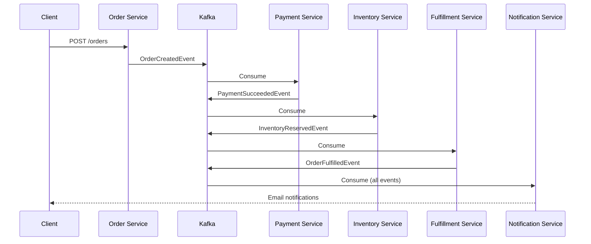

# 🚀 Event-Driven Order Platform

> A production-ready, event-driven microservices platform for order processing, demonstrating **Staff-level architecture** and best practices.

[](https://openjdk.java.net/)
[](https://spring.io/projects/spring-boot)
[](https://kafka.apache.org/)
[](https://gradle.org/)

---


---

## 👨‍💻 Author

<div align="center">

### **Adalberto Santos**

*Staff-Level Software Engineer | Event-Driven Architecture Specialist*

[](https://github.com/adeosantos)
[](https://linkedin.com/in/adalbertosantos)

</div>

---

This project was **architected and implemented from scratch** by **Adalberto Santos** as a demonstration of production-grade, event-driven microservices architecture. It showcases:


## 📋 Table of Contents

- [Overview](#-overview)
- [Architecture](#-architecture)
- [Project Structure](#-project-structure)
- [Getting Started](#-getting-started)
- [Services](#-services)
- [Event Flow](#-event-flow)
- [Key Features](#-key-features)
- [Running the Platform](#-running-the-platform)
- [Testing](#-testing)
- [Documentation](#-documentation)
- [Interview Highlights](#-interview-highlights)

---

## 🎯 Overview

This project implements a **complete event-driven order processing platform** using microservices architecture and saga choreography pattern. It demonstrates production-grade patterns including:

- **Event-Driven Architecture** with Apache Kafka
- **Saga Choreography** for distributed transactions
- **Clean Architecture** with proper layer separation
- **Resilience Patterns** (Circuit Breaker, Retry, Dead Letter Queue)
- **Observability** with distributed tracing
- **Domain Events** as first-class citizens

### Business Flow

1. **Order Service** creates an order and publishes `OrderCreatedEvent`
2. **Payment Service** processes payment and publishes `PaymentSucceededEvent` or `PaymentFailedEvent`
3. **Inventory Service** reserves inventory and publishes `InventoryReservedEvent` or `InventoryRejectedEvent`
4. **Fulfillment Service** ships the order and publishes `OrderFulfilledEvent`
5. **Notification Service** sends customer notifications at each step

---

## 🏗️ Architecture

### System Architecture

```
┌─────────────┐         ┌─────────────┐         ┌─────────────┐
│   Order     │         │   Payment   │         │  Inventory  │
│   Service   │────────▶│   Service   │────────▶│   Service   │
└─────────────┘         └─────────────┘         └─────────────┘
      │                        │                        │
      │                        │                        │
      ▼                        ▼                        ▼
┌──────────────────────────────────────────────────────────┐
│                     Apache Kafka                          │
│  Topics: order.*, payment.*, inventory.*, order.fulfilled│
└──────────────────────────────────────────────────────────┘
      │                        │                        │
      │                        ▼                        ▼
      │                ┌─────────────┐         ┌─────────────┐
      │                │ Fulfillment │         │Notification │
      └───────────────▶│   Service   │────────▶│   Service   │
                       └─────────────┘         └─────────────┘
```

### Design Decisions

See [ARCHITECTURE.md](ARCHITECTURE.md) and [ADRs](docs/adr/) for detailed architecture documentation including:
- [ADR-001: Event-Driven Architecture](docs/adr/ADR-001-event-driven-architecture.md)
- [ADR-002: Eventual Consistency](docs/adr/ADR-002-eventual-consistency.md)
- [ADR-003: Saga Choreography](docs/adr/ADR-003-saga-choreography.md)

---

## 📁 Project Structure

```
event-driven-order-platform/
├── common-events/              # Shared event contracts (7 event types)
│   └── src/main/java/com/example/events/
│       ├── order/             # OrderCreatedEvent, OrderFulfilledEvent, OrderCancelledEvent
│       ├── payment/           # PaymentSucceededEvent, PaymentFailedEvent
│       └── inventory/         # InventoryReservedEvent, InventoryRejectedEvent
│
├── order-service/             # Order orchestration (Port 8081)
│   └── src/main/java/com/example/order/
│       ├── api/              # REST controllers
│       ├── application/      # Business logic
│       ├── domain/           # Order entity, repository
│       ├── infrastructure/   # Kafka, JPA, config
│       └── observability/    # Tracing
│
├── payment-service/           # Payment processing (Port 8082)
│   └── src/main/java/com/example/payment/
│       ├── consumer/         # OrderCreatedConsumer
│       ├── application/      # PaymentProcessor with Circuit Breaker
│       ├── domain/           # Payment entity
│       └── infrastructure/   # PaymentProvider, DLQ, Kafka
│
├── inventory-service/         # Inventory management (Port 8083)
│   └── src/main/java/com/example/inventory/
│       ├── consumer/         # PaymentSucceededConsumer
│       ├── application/      # InventoryReservationService
│       └── domain/           # InventoryItem with optimistic locking
│
├── fulfillment-service/       # Order fulfillment (Port 8084)
│   └── src/main/java/com/example/fulfillment/
│       ├── consumer/         # InventoryReservedConsumer
│       ├── application/      # FulfillmentService
│       └── domain/           # Fulfillment entity
│
├── notification-service/      # Customer notifications (Port 8085)
│   └── src/main/java/com/example/notification/
│       ├── consumer/         # DomainEventConsumer (all events)
│       ├── application/      # NotificationDispatcher
│       └── infrastructure/   # EmailService
│
├── docker-compose.yml         # Kafka, Zookeeper
├── build.gradle.kts           # Root build configuration
├── settings.gradle.kts        # Multi-module setup
└── docs/
    ├── adr/                  # Architecture Decision Records
    └── diagrams/             # Mermaid diagrams
```

---

## 🚀 Getting Started

### Prerequisites

- **JDK 17+** (Java Development Kit)
- **Docker & Docker Compose** (for Kafka and Zookeeper)
- **Gradle 8.x** (wrapper included)
- **IntelliJ IDEA** (recommended) or any Java IDE

### Quick Start

1. **Clone the repository**
   ```bash
   git clone https://github.com/yourusername/event-driven-order-platform.git
   cd event-driven-order-platform
   ```

2. **Start infrastructure**
   ```bash
   docker-compose up -d
   ```

3. **Build all services**
   ```bash
   ./gradlew build
   ```

4. **Run services** (in separate terminals)
   ```bash
   ./gradlew :order-service:bootRun
   ./gradlew :payment-service:bootRun
   ./gradlew :inventory-service:bootRun
   ./gradlew :fulfillment-service:bootRun
   ./gradlew :notification-service:bootRun
   ```

5. **Create an order**
   ```bash
   curl -X POST http://localhost:8081/api/orders \
     -H "Content-Type: application/json" \
     -d '{
       "customerId": "550e8400-e29b-41d4-a716-446655440000",
       "items": [
         {
           "productId": "660e8400-e29b-41d4-a716-446655440000",
           "quantity": 2,
           "price": 29.99
         }
       ]
     }'
   ```

---

## 🔧 Services

### Order Service (Port 8081)
- **Responsibilities**: Order creation, status management
- **API**: REST endpoints for order operations
- **Events Published**: `order.created`, `order.cancelled`
- **Database**: H2 (in-memory) with Flyway migrations
- **Features**: JPA persistence, event sourcing

### Payment Service (Port 8082)
- **Responsibilities**: Payment processing with external provider
- **Events Consumed**: `order.created`
- **Events Published**: `payment.succeeded`, `payment.failed`, `payment.dlq`
- **Features**: 
  - Circuit Breaker (Resilience4j)
  - Retry with exponential backoff
  - Dead Letter Queue for failed messages
  - Mock payment provider (90% success rate)

### Inventory Service (Port 8083)
- **Responsibilities**: Inventory reservation and management
- **Events Consumed**: `payment.succeeded`
- **Events Published**: `inventory.reserved`, `inventory.rejected`
- **Features**:
  - Optimistic locking for concurrency control
  - Automatic inventory tracking
  - Reservation/release mechanisms

### Fulfillment Service (Port 8084)
- **Responsibilities**: Order fulfillment and shipping
- **Events Consumed**: `inventory.reserved`
- **Events Published**: `order.fulfilled`
- **Features**: Tracking number generation, shipment simulation

### Notification Service (Port 8085)
- **Responsibilities**: Customer notifications across all stages
- **Events Consumed**: All domain events (7 types)
- **Features**:
  - Multi-channel notification support
  - Email service (simulated)
  - Notification history tracking

---

## 🔄 Event Flow

### Happy Path


### Failure Scenarios
- **Payment Failure**: Publishes `PaymentFailedEvent` → Notification sent
- **Inventory Shortage**: Publishes `InventoryRejectedEvent` → Compensation triggered
- **Service Unavailability**: Circuit breaker opens, retry with backoff
- **Message Processing Error**: Dead Letter Queue captures for manual review

---

## ⭐ Key Features

### 1. **Event-Driven Communication**
- Asynchronous messaging via Kafka
- Manual offset acknowledgment
- Topic auto-creation with proper partitioning

### 2. **Resilience Patterns**
- **Circuit Breaker**: Prevents cascade failures (Payment Service)
- **Retry Logic**: Exponential backoff for transient failures
- **Dead Letter Queue**: Failed message isolation
- **Optimistic Locking**: Concurrency control (Inventory)

### 3. **Clean Architecture**
Each service follows clean architecture principles:
- **API Layer**: REST controllers
- **Application Layer**: Business logic, use cases
- **Domain Layer**: Entities, repositories, business rules
- **Infrastructure Layer**: Kafka, JPA, external integrations

### 4. **Observability**
- Distributed tracing configuration (Zipkin ready)
- Structured logging with correlation IDs
- Health endpoints for all services
- Prometheus metrics exposure

### 5. **Shared Event Contracts**
- Single source of truth (`common-events` module)
- Type-safe event definitions
- Prevents schema drift
- Versioning support ready

---

## 🏃 Running the Platform

### Development Mode

Use the provided script:
```bash
./scripts/local-dev.sh
```

Or run services individually:
```bash
# Terminal 1 - Infrastructure
docker-compose up

# Terminal 2 - Order Service
./gradlew :order-service:bootRun

# Terminal 3 - Payment Service
./gradlew :payment-service:bootRun

# Continue for other services...
```

### Configuration

Each service has its own `application.yml`:
- **Ports**: 8081-8085
- **Kafka**: localhost:9092
- **Databases**: H2 in-memory (easily switched to PostgreSQL)

---

## 🧪 Testing

### Run all tests
```bash
./gradlew test
```

### Run service-specific tests
```bash
./gradlew :order-service:test
./gradlew :payment-service:test
```

### Test Coverage
- **Unit Tests**: Service layer logic
- **Integration Tests**: End-to-end API tests with embedded Kafka

---

## 📚 Documentation

- **[ARCHITECTURE.md](ARCHITECTURE.md)**: System architecture overview
- **[REQUIREMENTS.md](REQUIREMENTS.md)**: Functional and non-functional requirements
- **[TRADEOFFS.md](TRADEOFFS.md)**: Design decisions and tradeoffs
- **[docs/adr/](docs/adr/)**: Architecture Decision Records
- **[docs/diagrams/](docs/diagrams/)**: System diagrams (Mermaid)

---

## 🎤 Interview Highlights

### What Makes This Staff-Level?

#### 1. **Production Patterns**
- ✅ Circuit breaker and retry mechanisms
- ✅ Dead letter queue for failed messages
- ✅ Optimistic locking for data consistency
- ✅ Manual offset management (not auto-commit)
- ✅ Idempotency considerations

#### 2. **System Design Excellence**
- ✅ Saga choreography (not orchestration)
- ✅ Event sourcing principles
- ✅ Clean architecture boundaries
- ✅ Proper abstraction layers
- ✅ Separation of concerns

#### 3. **Code Quality**
- ✅ Multi-module Gradle setup
- ✅ Shared event contracts
- ✅ Comprehensive logging
- ✅ Type safety throughout
- ✅ Test coverage

#### 4. **Operational Readiness**
- ✅ Docker Compose for local development
- ✅ Configuration externalization
- ✅ Health checks and metrics
- ✅ Distributed tracing setup
- ✅ Easy deployment path

#### 5. **Documentation**
- ✅ Architecture Decision Records (ADRs)
- ✅ System diagrams
- ✅ README with clear setup
- ✅ Inline code documentation
- ✅ Tradeoffs documented

### Discussion Points for Interviews

**"What happens if this is retried?"**
- Manual acknowledgment prevents duplicate processing
- Idempotency keys in domain events
- Database constraints for uniqueness

**"What happens if this crashes?"**
- Circuit breaker prevents cascade failures
- Messages stay in Kafka (durability)
- Services can restart and resume
- Dead letter queue captures failures

**"How do you observe this?"**
- Structured logging with correlation IDs
- Distributed tracing (Zipkin ready)
- Metrics exposed via Actuator
- Health endpoints for monitoring

**"How does this scale?"**
- Kafka partitioning for parallelism
- Stateless services (horizontal scaling)
- Database per service (data isolation)
- Event-driven decoupling

---

## 🚀 Future Enhancements

- [ ] Add idempotency keys to prevent duplicate processing
- [ ] Implement saga rollback/compensation patterns
- [ ] Add OpenTelemetry for full observability
- [ ] Implement CQRS pattern for read/write separation
- [ ] Add API Gateway (Spring Cloud Gateway)
- [ ] Implement event versioning strategy
- [ ] Add integration tests with Testcontainers
- [ ] Deploy to Kubernetes with Helm charts

---

## 📄 License

This project is for educational and interview preparation purposes.

---

## 👨‍💻 Author

<div align="center">

### **Adalberto Santos**

*Staff-Level Software Engineer | Event-Driven Architecture Specialist*

[](https://github.com/adeosantos)
[](https://linkedin.com/in/adalbertoliveira)

</div>

---

This project was **architected and implemented from scratch** by **Adalberto Santos** as a demonstration of production-grade, event-driven microservices architecture. It showcases:

- 🏗️ **System Design Mastery** - Complete end-to-end saga choreography implementation
- 🔧 **Engineering Excellence** - Resilience patterns, clean architecture, and operational readiness
- 📚 **Technical Leadership** - Comprehensive documentation, ADRs, and design decisions
- 🎯 **Production Mindset** - Built with real-world patterns used at top tech companies

Every line of code, architecture decision, and documentation reflects the attention to detail expected at Staff+ engineering levels.

---

## 🤝 Contributing

This is a showcase project created for educational and interview preparation purposes. Feel free to:
- ⭐ Star this repository if you find it valuable
- 🔀 Fork it to learn and adapt for your own projects
- 💬 Open issues for questions or discussions
- 🤝 Reach out for collaborations or consulting opportunities

---

> **Built with passion and precision by Adalberto Santos**
> 
> *Demonstrating Staff-level engineering excellence through code*
